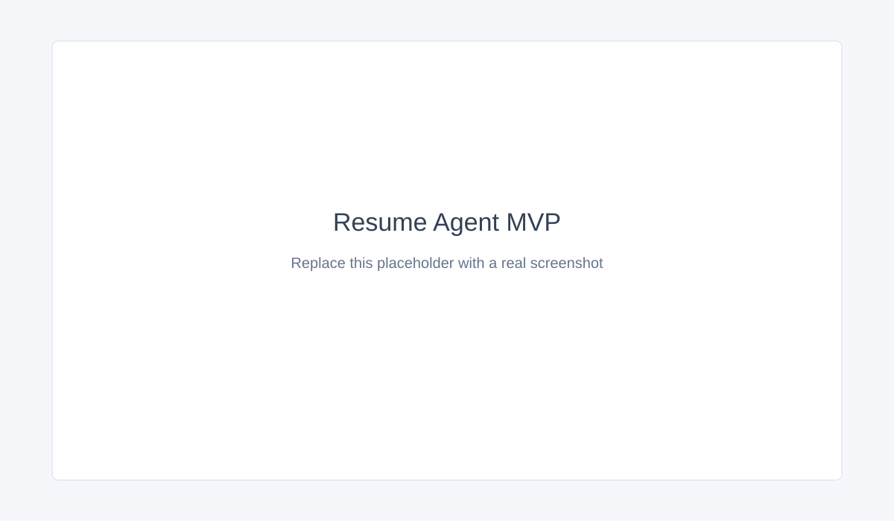
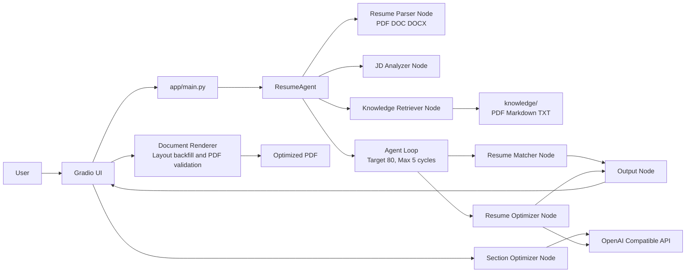
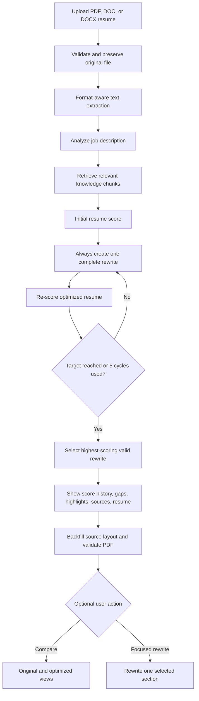

# ResumeFlow AI (Resume Agent MVP)

An open-source AI Agent demo that analyzes a PDF, DOC, or DOCX resume against a job description, retrieves relevant resume-writing guidance, and produces a complete, evidence-grounded rewrite with a verified optimized PDF download.

This project is intentionally small. It is designed as a portfolio project for demonstrating AI workflow orchestration, prompt engineering, local RAG, OpenAI-compatible LLM calls, and iterative agent loops.

## Project Introduction

ResumeFlow AI accepts two inputs:

1. A PDF, DOC, or DOCX resume (up to 15 MB).
2. A pasted job description.

It then runs a modular workflow that:

- validates extension, MIME type, file signature, size, corruption, and parseability before any LLM call;
- preserves the original file and its name, type, size, and canonical MIME metadata;
- extracts PDF text with PyMuPDF and DOCX text from its WordprocessingML package;
- converts legacy DOC through LibreOffice when that capability is available;
- analyzes the job description;
- retrieves relevant guidance from the local `knowledge/` directory;
- scores the resume against the role;
- always performs at least one complete resume rewrite, even when the initial score is already 80 or higher;
- continues optimizing and re-scoring when needed, stopping at 80 or after five optimization cycles;
- keeps the highest-scoring valid rewritten draft instead of blindly returning the last draft;
- validates generated numeric and contact anchors against the uploaded source and falls back safely when a response is incomplete or suspicious;
- returns score history, missing skills, suggestions, structured change explanations, knowledge sources, and a complete optimized resume;
- exports only a validated PDF, using the source PDF layout or the original DOCX package wherever the runtime can do so reliably.

The UI supports original/optimized switching, responsive side-by-side comparison, full-text copy, optimized PDF download, full regeneration, section-level rewriting, and applying a selected suggestion to a selected resume section. A focused rewrite also regenerates the downloadable PDF.

The application has no login, database, payments, history, or multi-page navigation.

## Demo Screenshot

Screenshot placeholder: add a real screenshot at `assets/screenshots/resume-agent.png` after running the app locally.



## Tech Stack

| Layer | Technology |
| --- | --- |
| UI | Gradio |
| Backend | Python 3.10+ |
| LLM | OpenAI Compatible Chat Completions API |
| PDF parsing and export | PyMuPDF |
| DOCX package handling | WordprocessingML ZIP/XML backfill (plus `python-docx` for future extension work) |
| DOC/DOCX to PDF | Optional LibreOffice / `soffice`, detected at runtime |
| Configuration | `.env` + `python-dotenv` |
| Dependency management | uv + `pyproject.toml` |
| RAG | Local PDF/Markdown/TXT retrieval with lexical relevance scoring |

## Architecture



## Workflow



## Quickstart

### Prerequisites

- Python 3.10 or newer
- [uv](https://docs.astral.sh/uv/)
- An API key for an OpenAI-compatible provider

### Install

```bash
uv sync
```

### Configure

```bash
copy .env.example .env
```

Set the following values in `.env`:

```dotenv
OPENAI_API_KEY=your-api-key
OPENAI_BASE_URL=https://api.openai.com/v1
OPENAI_MODEL=gpt-4o-mini
OPENAI_TIMEOUT_SECONDS=45
```

`OPENAI_BASE_URL` and `OPENAI_MODEL` can be changed for another compatible provider.
`OPENAI_TIMEOUT_SECONDS` bounds each model request so a stalled provider returns a visible error instead of leaving the page waiting indefinitely.

If the UI reports `WEEKLY_LIMIT_EXCEEDED`, the configured provider account has exhausted its weekly allowance. Wait for the provider reset, raise that account's limit, or configure another compatible provider/key pair; this cannot be repaired in application code.

### Run

```bash
uv run python -m app.main
```

Open the local Gradio URL, upload a PDF, DOC, or DOCX resume, paste a job description, and select **Start Analysis and Generate Optimized Resume**.
The button sends an immediate progress update before the queued Agent workflow starts; a complete run can take longer when the bounded optimization loop makes several model calls.

### Document Fidelity

| Upload | Analysis | Optimized PDF behavior |
| --- | --- | --- |
| PDF | Native PyMuPDF extraction | Reuses original pages, images, graphics, text rectangles, colors, and page sizes where possible. Text length changes can still alter wrapping, so this is not claimed as 100% pixel-identical. |
| DOCX | Native WordprocessingML extraction | Replaces text inside the original DOCX package while retaining styles, tables, images, columns, margins, headers, footers, and section settings. LibreOffice is required for the final high-fidelity PDF conversion. |
| DOC | LibreOffice conversion | Requires LibreOffice for reliable parsing and conversion. When it is unavailable, the UI gives a clear DOCX recommendation instead of producing a malformed file. |

Without LibreOffice, DOCX analysis still works and the application exports a clean, content-complete fallback PDF with an explicit fidelity notice. Install LibreOffice or set `SOFFICE_PATH` to enable source-layout DOC/DOCX conversion. The final user-facing download is always PDF; the internal backfilled DOCX is never offered as a download.

Generated names follow the upload: `张三简历.docx` becomes `张三简历修改版.pdf`, while `resume.pdf` becomes `resume简历修改版.pdf`. Windows-invalid characters are replaced with `_` without removing Chinese text.

## Deployment

The repository includes a generic [`Dockerfile`](Dockerfile) and a Render blueprint [`render.yaml`](render.yaml). Both use the `PORT` environment variable supplied by the hosting platform and bind Gradio to `0.0.0.0` in hosted environments.

For a Render deployment:

1. Push this repository to GitHub.
2. Create a Render Web Service from the repository or use **Blueprint** with `render.yaml`.
3. Set `OPENAI_API_KEY` in the Render environment settings.
4. Deploy and open the generated `onrender.com` URL.

Never commit API keys. The public service should use a restricted key with an appropriate spending limit.

The included `render.yaml` builds the Dockerfile, which installs LibreOffice Writer and Noto CJK fonts so deployed DOC parsing and source-layout DOCX-to-PDF conversion use the full path. A local native-Python launch still uses the documented fallback whenever `soffice` is unavailable.

## Local RAG Knowledge Base

Place additional `.pdf`, `.md`, or `.txt` files in `knowledge/`. The application loads and chunks these files at startup. At analysis time, it retrieves the most relevant chunks using the resume and job description, then injects those chunks into the Resume Optimizer prompt.

The repository includes guidance on:

- STAR achievement bullets;
- the Google resume guide principles;
- an AI Engineer resume structure;
- ATS-friendly formatting and keyword usage.

The current retriever is deliberately dependency-light and explainable. It can later be replaced with embeddings and a vector store without changing the workflow node contract.

## Project Structure

```text
.
├── .github/
│   ├── ISSUE_TEMPLATE/
│   ├── workflows/tests.yml
│   └── pull_request_template.md
├── agent/
│   ├── agent_loop.py
│   ├── resume_agent.py
│   └── nodes/
│       ├── resume_optimizer.py
│       └── resume_section_optimizer.py
├── app/
│   └── main.py
├── assets/
│   └── screenshots/
├── knowledge/
├── prompt/
├── services/
│   ├── document_input.py
│   ├── document_parser.py
│   ├── resume_export.py
│   ├── resume_markdown.py
│   └── resume_validation.py
├── tests/
├── utils/
├── .env.example
├── .gitignore
├── CONTRIBUTING.md
├── Dockerfile
├── LICENSE
├── README.md
├── pyproject.toml
├── render.yaml
└── requirements.txt
```

## Development Checks

Run a syntax check with the bundled project environment:

```bash
uv run python -m compileall -q app agent services utils
```

Run the offline automated test suite:

```bash
uv run python -m unittest discover -s tests -v
```

Keep prompts in `prompt/`, provider-specific code in `services/`, and workflow orchestration in `agent/`. New nodes should expose a typed input and output contract.

## Roadmap

| Status | Item |
| --- | --- |
| Done | Single-page Gradio MVP |
| Done | Modular Parser, JD Analyzer, Matcher, Optimizer, and Output nodes |
| Done | Bounded Agent Loop with score history |
| Done | Local PDF/Markdown/TXT RAG knowledge base |
| Done | Complete grounded resume rewriting with safe fallback |
| Done | PDF, DOC, and DOCX validation with durable original-file metadata |
| Done | Layout-aware PDF backfill and DOCX package backfill |
| Done | Verified optimized PDF-only download and safe source-based naming |
| Done | Original/optimized comparison and full-text copy |
| Done | Section-level rewriting and applying selected suggestions |
| Done | Offline parser, loop, safety, output, and UI contract tests |
| Planned | Embedding-based retrieval with a replaceable vector store |
| Planned | Provider adapters for Qwen, Claude, and local models |
| Planned | Provider-backed evaluation fixtures and groundedness benchmarks |
| Planned | Optional streaming output and structured run tracing |
| Planned | Memory and Tool Calling extension points |
| Planned | OCR for scanned image-only PDF resumes |

## Future Planning

The next architectural improvements should remain additive:

1. Introduce a `Retriever` protocol so lexical and embedding retrieval share one interface.
2. Add evaluation datasets for score consistency, groundedness, and resume faithfulness.
3. Add a workflow event stream for inspecting every node input, output, and latency.
4. Add optional memory only after the stateless MVP behavior is stable.
5. Keep all provider integrations behind the existing LLM client boundary.

## Issues

Please use [GitHub Issues](../../issues) for bug reports and feature requests. Include the input format, provider configuration (without secrets), expected behavior, actual behavior, and relevant logs.

Issue templates are available for:

- reproducible bug reports;
- feature requests and workflow ideas.

## Contributing

See [CONTRIBUTING.md](CONTRIBUTING.md) for local setup, code style, testing expectations, and pull request guidance.

## License

This project is released under the [MIT License](LICENSE).
