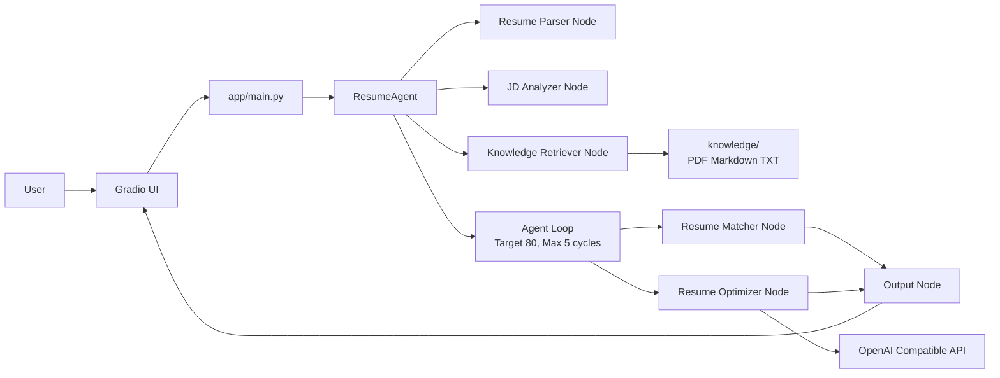
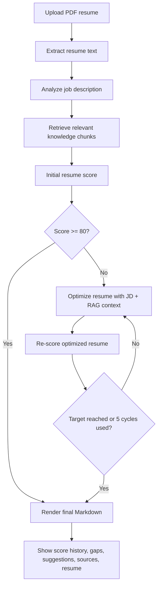

# Resume Agent MVP

An open-source AI Agent demo that analyzes a PDF resume against a job description, retrieves relevant resume-writing guidance, and produces an evidence-based optimized resume in Markdown.

This project is intentionally small. It is designed as a portfolio project for demonstrating AI workflow orchestration, prompt engineering, local RAG, OpenAI-compatible LLM calls, and iterative agent loops.

## Project Introduction

Resume Agent MVP accepts two inputs:

1. A PDF resume.
2. A pasted job description.

It then runs a modular workflow that:

- extracts resume text with PyMuPDF;
- analyzes the job description;
- retrieves relevant guidance from the local `knowledge/` directory;
- scores the resume against the role;
- iteratively optimizes and re-scores the resume until the score reaches 80 or five optimization cycles are used;
- returns score history, missing skills, suggestions, knowledge sources, and an optimized Markdown resume.

The application has no login, database, payments, history, or multi-page navigation.

## Demo Screenshot

Screenshot placeholder: add a real screenshot at `assets/screenshots/resume-agent.png` after running the app locally.


## Tech Stack

| Layer | Technology |
| --- | --- |
| UI | Gradio |
| Backend | Python 3.10+ |
| LLM | OpenAI Compatible Chat Completions API |
| PDF parsing | PyMuPDF |
| Configuration | `.env` + `python-dotenv` |
| Dependency management | uv + `pyproject.toml` |
| RAG | Local PDF/Markdown/TXT retrieval with lexical relevance scoring |

## Architecture



## Workflow



## Quickstart

### Prerequisites

- Python 3.10 or newer
- [uv](https://docs.astral.sh/uv/)
- An API key for an OpenAI-compatible provider

### Install

```bash
uv sync
```

### Configure

```bash
copy .env.example .env
```

Set the following values in `.env`:

```dotenv
OPENAI_API_KEY=your-api-key
OPENAI_BASE_URL=https://api.openai.com/v1
OPENAI_MODEL=gpt-4o-mini
```

`OPENAI_BASE_URL` and `OPENAI_MODEL` can be changed for another compatible provider.

### Run

```bash
uv run python -m app.main
```

Open the local Gradio URL, upload a PDF resume, paste a job description, and select **Start Analysis**.

## Deployment

The repository includes a generic [`Dockerfile`](Dockerfile) and a Render blueprint [`render.yaml`](render.yaml). Both use the `PORT` environment variable supplied by the hosting platform and bind Gradio to `0.0.0.0` in hosted environments.

For a Render deployment:

1. Push this repository to GitHub.
2. Create a Render Web Service from the repository or use **Blueprint** with `render.yaml`.
3. Set `OPENAI_API_KEY` in the Render environment settings.
4. Deploy and open the generated `onrender.com` URL.

Never commit API keys. The public service should use a restricted key with an appropriate spending limit.

## Local RAG Knowledge Base

Place additional `.pdf`, `.md`, or `.txt` files in `knowledge/`. The application loads and chunks these files at startup. At analysis time, it retrieves the most relevant chunks using the resume and job description, then injects those chunks into the Resume Optimizer prompt.

The repository includes guidance on:

- STAR achievement bullets;
- the Google resume guide principles;
- an AI Engineer resume structure;
- ATS-friendly formatting and keyword usage.

The current retriever is deliberately dependency-light and explainable. It can later be replaced with embeddings and a vector store without changing the workflow node contract.

## Project Structure

```text
.
├── .github/
│   ├── ISSUE_TEMPLATE/
│   └── pull_request_template.md
├── agent/
│   ├── agent_loop.py
│   ├── resume_agent.py
│   └── nodes/
├── app/
│   └── main.py
├── assets/
│   └── screenshots/
├── knowledge/
├── prompt/
├── services/
├── utils/
├── .env.example
├── .gitignore
├── CONTRIBUTING.md
├── Dockerfile
├── LICENSE
├── README.md
├── pyproject.toml
├── render.yaml
└── requirements.txt
```

## Development Checks

Run a syntax check with the bundled project environment:

```bash
uv run python -m compileall -q app agent services utils
```

Keep prompts in `prompt/`, provider-specific code in `services/`, and workflow orchestration in `agent/`. New nodes should expose a typed input and output contract.

## Roadmap

| Status | Item |
| --- | --- |
| Done | Single-page Gradio MVP |
| Done | Modular Parser, JD Analyzer, Matcher, Optimizer, and Output nodes |
| Done | Bounded Agent Loop with score history |
| Done | Local PDF/Markdown/TXT RAG knowledge base |
| Planned | Embedding-based retrieval with a replaceable vector store |
| Planned | Provider adapters for Qwen, Claude, and local models |
| Planned | Node-level automated tests and evaluation fixtures |
| Planned | Optional streaming output and structured run tracing |
| Planned | Memory and Tool Calling extension points |

## Future Planning

The next architectural improvements should remain additive:

1. Introduce a `Retriever` protocol so lexical and embedding retrieval share one interface.
2. Add evaluation datasets for score consistency, groundedness, and resume faithfulness.
3. Add a workflow event stream for inspecting every node input, output, and latency.
4. Add optional memory only after the stateless MVP behavior is stable.
5. Keep all provider integrations behind the existing LLM client boundary.

## Issues

Please use [GitHub Issues](../../issues) for bug reports and feature requests. Include the input format, provider configuration (without secrets), expected behavior, actual behavior, and relevant logs.

Issue templates are available for:

- reproducible bug reports;
- feature requests and workflow ideas.

## Contributing

See [CONTRIBUTING.md](CONTRIBUTING.md) for local setup, code style, testing expectations, and pull request guidance.

## License

This project is released under the [MIT License](LICENSE).
